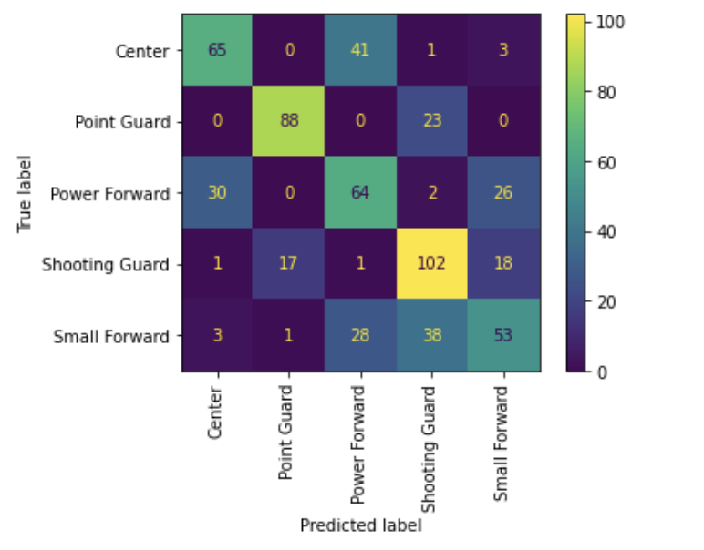

# Predicting Basketball Positions

## Background and Motivation 
While I'm not an avid basketball fan, I am also not completely indifferent to the sport as I constantly hear my fiancè trash talk his friends during fantasy every season. I don't know too much about basketball, but of course I know about the big household names like LeBron James who is often touted as the "GOAT". LeBron James is overall dynamic and can play well as different positions on the court but he's also kind of a unicorn as not many people are like that, or so I think. However, I keep hearing this term "positionless" being tossed around and how basketball is becoming more and more "positionless"."Positionless basketball" is that instead of players playing certain positions (i.e. point guard, shooting guard, etc.), all players can play at any place on the court. People constantly argue that there has been major shift for a lot of teams as we now see traditional roles and positions on the court going by the wayside in favor of more dynamic players who can slot into multiple different spots on the court. However, is basketball really becoming "positionless"? For this project, I will try to predict basketball positions based on player stats and see whether or not my models will have trouble doing so - if in fact, player's can still be categorized by the 5 traditional positions, or will it be hard to do so because players are truly becoming more positionless?
 
 ## Data
 [Basketball-reference.com](https://www.basketball-reference.com/) 
 Scraped career per game average box scores for all NBA basketball players  
 4,390 Players with 25 stats 

 ## EDA 

 The first thing I checked was the balance of my classes. However, when plotting it, I realized that there were many labels. Given that I was pulling total career stats, some players were categorized as multiple positions since they had played as other positions on other teams throughout their career.

The way basketball reference lists out the multiple positions is that the first one in the list is the position that the player had played mostly in. In order to keep things simple and to the 5 traditional positions, I only took the first position of the list. After doing so and plotting the distribution of the positions, you can see the classes are relatively balanced. 

Since the data contains all NBA basketball players thus far, that means my data includes not only short contract players (i.e. 10 day contract deal like Antonio Anderson had done with OKC) but also rookies. I wanted to filter some of these players out given that they probably haven't played that many games at all and their current performance and stats wouldn't be reflective of their true performance. Since each season, each team tpyically plays 82 games, I dropped those who played less than 20 games which is just about 1/4 of a season (dropped 114 players ~ 2.5% of my data). 

My first pass at a model, I knew I wanted to look at the 5 main stats. As you can see for points, there is not much different position by position. However, we see serious differences in a few categories such as total rebounds and assists. This gives a good idea about what to expect in the model, especially in terms of what the model deems to be the most important features to help determine a player's position. 

## Models and Considerations 
The models that I had used were random forest and logistic regression. 
With logistic regression being the best model. After choosing features based on Gini Importance and trying a few different combination of features, our best model was a logistic regression with 65.9% accuracy. I decided to use accuracy as my evalution metric since in this case we aren't particular concerned more about either false positive or false negative  - in this case their both have similar costs. The parameters were max_iter = 1000 and C = 250. This is having dropped NaNs and changing 3 pointers to 0 where there were NaNs (prior to 1979, 3 pointers were not a thing!). However, given that seeing a break down of NaNs by feature - I noticed that were a lot of NaNs and thus we were dropping a significant amount of data. Having dropped NaNs, we were only considering 3023 players (dropped ~16% of data). With that being said, I compared this model to one where I used KNN imputer to fill out NaNs and results were not bad at 63.9% accuracy considering that allows us to use our whole dataset (which is already small to begin with).

## Looking Forward
Across all the different models, the models were misclassifying in very similar areas - mistaking Centers for Power Forwards and Shooting Guards with Small Forwards which are players that tend to have the most overlap.

Our roc curves across all the different models were also similar in that Small Forwards and Point Guards tend to do the worse - this also makes sense since those tends to be the more versatile players. 

For possible next steps, I'd love to: 
Incorporate more advanced stats (i.e. FGA by distance, dunks, corner 3s etc.) to see what are the defining features for the different positions and try to improve my model in the areas where it was getting confused and misclassifying 
Consider different seasons as different players (i.e. 2012-13 LeBron James vs current LeBron James as two distinct players)
